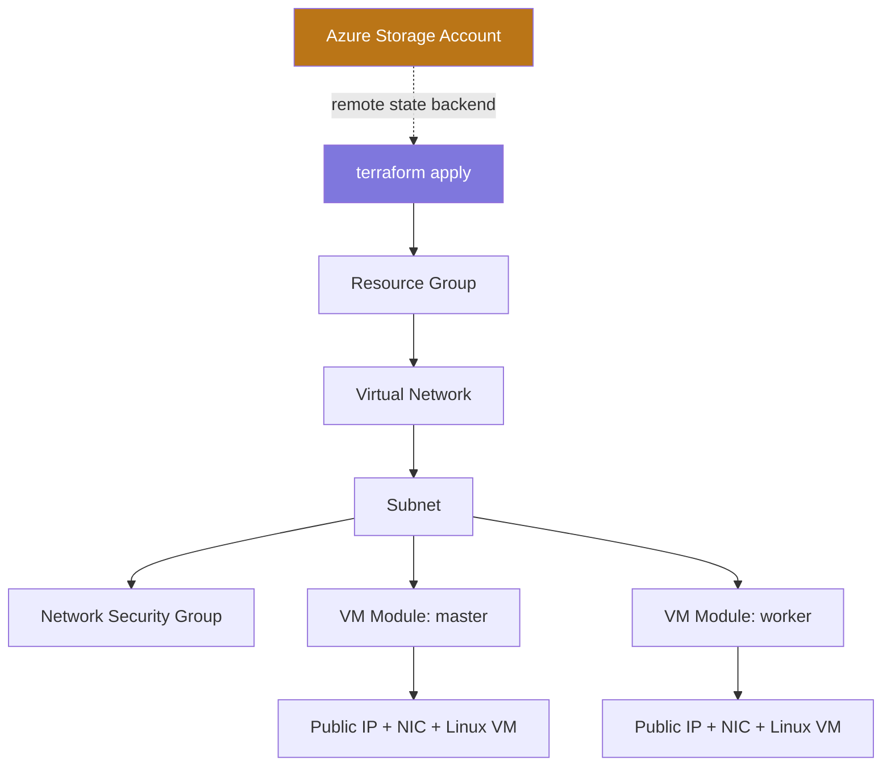

# Terraform on Azure — Infrastructure as Code

Provisions a complete Azure environment from code: resource group, virtual network, subnets, network security group, and two Linux VMs. Built to learn Terraform fundamentals — providers, variables, remote state, and modules — using real cloud infrastructure rather than throwaway examples.

## What this builds

- Resource group to contain all project resources
- Virtual network with a dedicated subnet
- Network security group allowing SSH access
- Two Ubuntu 22.04 Linux VMs (Used for Kubernetes Cluster)
- Remote state stored in Azure Blob Storage with state locking
- A reusable Terraform module for provisioning a Linux VM

## Architecture



## Stack

| Component | Tool |
|---|---|
| IaC | Terraform >= 1.6 |
| Cloud provider | Azure (azurerm provider) |
| State backend | Azure Blob Storage |
| OS image | Ubuntu 22.04 LTS |

## Repository structure

```
terraform-azure/
├── providers.tf       # provider + backend config
├── variables.tf        # input variables
├── terraform.tfvars     # variable values (gitignored if sensitive)
├── main.tf             # resource group, network, module calls
├── outputs.tf           # VM IPs and other outputs
└── modules/
    └── linux-vm/        # reusable VM module
        ├── main.tf
        ├── variables.tf
        └── outputs.tf
```

## Prerequisites

- Azure account with an active subscription
- Terraform CLI installed
- Azure CLI installed and authenticated (`az login`)
- An SSH key pair (`~/.ssh/id_rsa.pub`)

## Usage

```bash
git clone <this-repo>
cd terraform-azure

terraform init
terraform plan
terraform apply
```

Connect to a VM:

```bash
ssh adminuser@$(terraform output -raw master_public_ip)
```

Tear everything down:

```bash
terraform destroy
```

## What I learned

- Declarative infrastructure vs imperative scripting
- The Terraform plan/apply/destroy lifecycle and reading plan output
- Variables, outputs, and locals — and when to use each
- Why and how to separate Terraform code across multiple files
- Remote state in Azure Blob Storage and why local state is dangerous
- Writing and calling reusable Terraform modules
- Proving infrastructure is reproducible via full destroy/rebuild cycles
